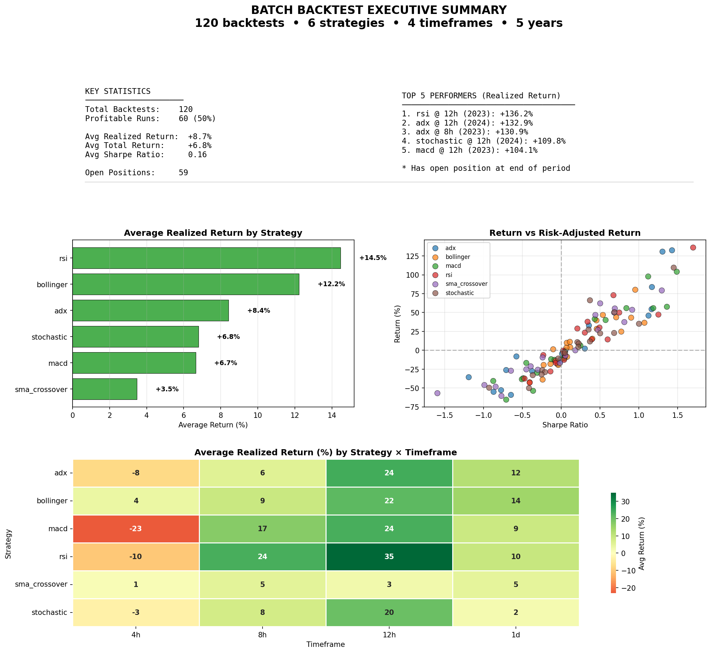
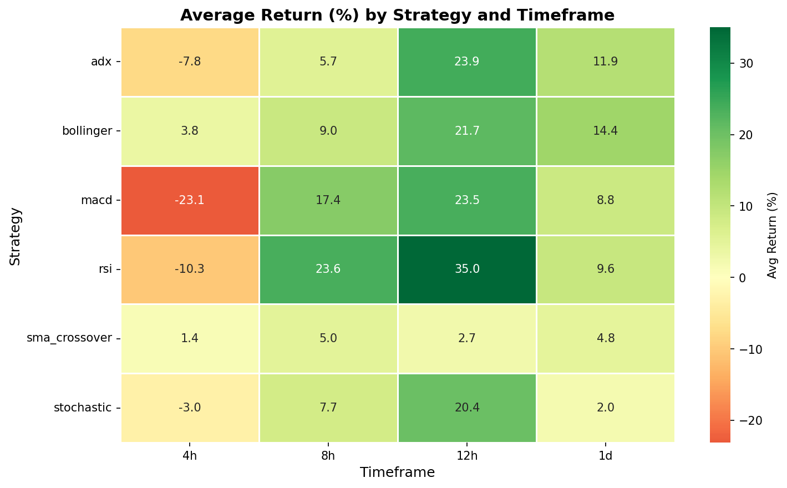
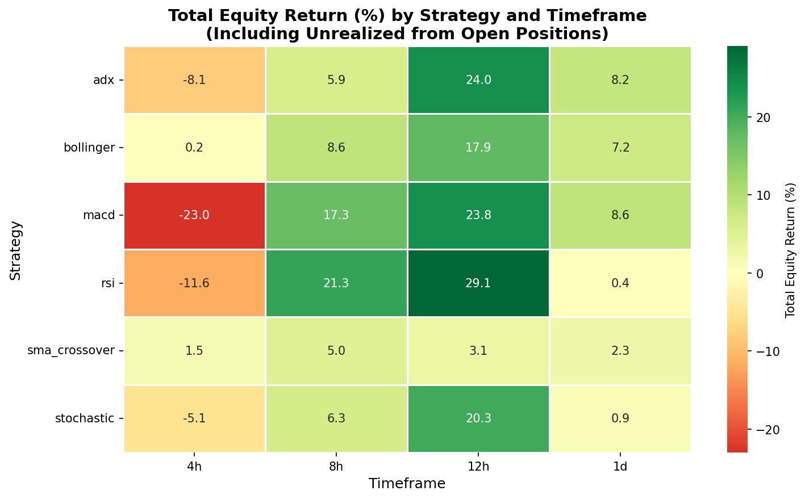
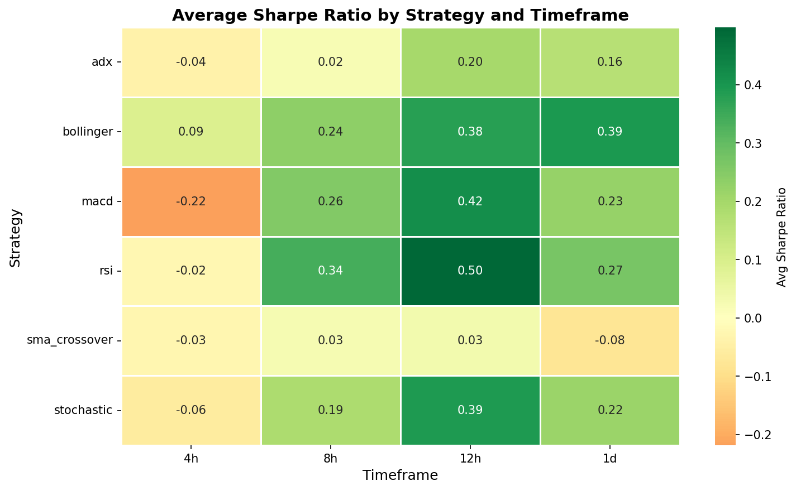
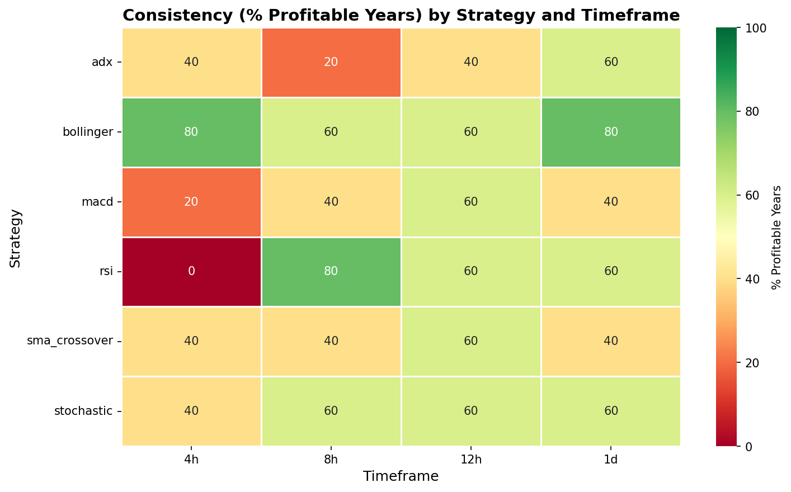

# Batch Backtest Summary Report

**Generated:** 2025-12-10 23:21:42

---

## Executive Summary

| Metric | Value |
|--------|-------|
| Total Backtests | 120 |
| Strategies Tested | 6 |
| Timeframes Tested | 4 |
| Years Tested | 5 |
| Profitable Runs | 60 (50.0%) |
| Avg Realized Return | +8.68% |
| Avg Total Return | +6.83% |
| Open Positions | 59 runs |
| Stop-Loss | Disabled (0 total exits) |

### Best Overall Performance

| Metric | Value |
|--------|-------|
| **Strategy** | rsi |
| **Timeframe** | 12h |
| **Year** | 2023 |
| **Realized Return** | +136.24% |
| **Total Return** | +136.24% |
| **Sharpe Ratio** | 1.70 |
| **Max Drawdown** | 18.83% |
| **Win Rate** | 90.0% |

### Worst Overall Performance

| Metric | Value |
|--------|-------|
| **Strategy** | macd |
| **Timeframe** | 4h |
| **Year** | 2022 |
| **Return** | -65.34% |

## Best Strategy Per Year

| Year | Strategy | Timeframe | Return % | Sharpe | Max DD % | Win Rate % | Trades |
|------|----------|-----------|----------|--------|----------|------------|--------|
| 2021 | stochastic | 4h | +66.37 | 0.37 | 34.94 | 70.7 | 41 |
| 2022 | rsi | 12h | -16.65 | -0.07 | 38.44 | 60.0 | 10 |
| 2023 | rsi | 12h | +136.24 | 1.70 | 18.83 | 90.0 | 10 |
| 2024 | adx | 12h | +132.90 | 1.42 | 17.76 | 57.9 | 19 |
| 2025 | bollinger | 4h | +39.58 | 0.45 | 28.98 | 70.4 | 27 |

## Best Strategy Per Timeframe (Averaged Across Years)

| Timeframe | Strategy | Avg Return % | Avg Sharpe | Avg Max DD % | Avg Win Rate % |
|-----------|----------|--------------|------------|--------------|----------------|
| 12h | rsi | +35.03 | 0.50 | 28.55 | 74.3 |
| 1d | bollinger | +14.45 | 0.39 | 27.43 | 66.3 |
| 4h | bollinger | +3.79 | 0.09 | 36.55 | 59.9 |
| 8h | rsi | +23.63 | 0.34 | 33.53 | 68.1 |

## Best Timeframe Per Strategy (Averaged Across Years)

| Strategy | Best Timeframe | Avg Return % | Avg Sharpe | Avg Max DD % |
|----------|----------------|--------------|------------|--------------|
| adx | 12h | +23.93 | 0.20 | 37.61 |
| bollinger | 12h | +21.72 | 0.38 | 29.80 |
| macd | 12h | +23.52 | 0.42 | 30.21 |
| rsi | 12h | +35.03 | 0.50 | 28.55 |
| sma_crossover | 8h | +5.00 | 0.03 | 35.21 |
| stochastic | 12h | +20.42 | 0.39 | 29.75 |

## Consistency Rankings (Profitable Years)

| Rank | Strategy | Timeframe | Profitable Years | Consistency | Avg Return % | Volatility |
|------|----------|-----------|------------------|-------------|--------------|------------|
| 1 | rsi | 8h | 4/5 | 80% | +23.63 | 43.70 |
| 2 | bollinger | 1d | 4/5 | 80% | +14.45 | 23.00 |
| 3 | bollinger | 4h | 4/5 | 80% | +3.79 | 28.02 |
| 4 | rsi | 12h | 3/5 | 60% | +35.03 | 61.67 |
| 5 | macd | 12h | 3/5 | 60% | +23.52 | 56.65 |
| 6 | bollinger | 12h | 3/5 | 60% | +21.72 | 40.27 |
| 7 | stochastic | 12h | 3/5 | 60% | +20.42 | 53.69 |
| 8 | adx | 1d | 3/5 | 60% | +11.93 | 37.98 |
| 9 | rsi | 1d | 3/5 | 60% | +9.57 | 32.67 |
| 10 | bollinger | 8h | 3/5 | 60% | +8.98 | 39.16 |

## Risk-Adjusted Rankings (Average Sharpe Ratio)

| Rank | Strategy | Timeframe | Avg Sharpe | Avg Return % | Avg Max DD % | Avg Win Rate % |
|------|----------|-----------|------------|--------------|--------------|----------------|
| 1 | rsi | 12h | 0.50 | +35.03 | 28.55 | 74.3 |
| 2 | macd | 12h | 0.42 | +23.52 | 30.21 | 36.7 |
| 3 | bollinger | 1d | 0.39 | +14.45 | 27.43 | 66.3 |
| 4 | stochastic | 12h | 0.39 | +20.42 | 29.75 | 74.0 |
| 5 | bollinger | 12h | 0.38 | +21.72 | 29.80 | 72.0 |
| 6 | rsi | 8h | 0.34 | +23.63 | 33.53 | 68.1 |
| 7 | rsi | 1d | 0.27 | +9.57 | 33.09 | 73.3 |
| 8 | macd | 8h | 0.26 | +17.35 | 28.44 | 34.6 |
| 9 | bollinger | 8h | 0.24 | +8.98 | 32.63 | 67.2 |
| 10 | macd | 1d | 0.23 | +8.85 | 28.94 | 33.9 |

## Open Positions

The following backtests ended with open positions (unrealized P&L not included in trade statistics):

| Strategy | TF | Year | Direction | Entry Price | Unrealized % | Realized → Total |
|----------|-----|------|-----------|-------------|--------------|------------------|
| sma_crossover | 4h | 2025 | LONG | $91,979.43 | +0.41% | -25.78% → -25.48% |
| sma_crossover | 12h | 2025 | LONG | $89,656.00 | +2.26% | -21.20% → -19.43% |
| sma_crossover | 1d | 2021 | LONG | $50,792.37 | -9.52% | -27.07% → -34.00% |
| sma_crossover | 1d | 2023 | LONG | $43,585.18 | -3.50% | +37.39% → +32.59% |
| sma_crossover | 1d | 2025 | LONG | $92,080.40 | -0.56% | -9.19% → -9.69% |
| rsi | 4h | 2021 | LONG | $47,973.66 | -2.16% | -6.81% → -8.81% |
| rsi | 4h | 2022 | LONG | $16,777.49 | -1.81% | -28.03% → -29.33% |
| rsi | 4h | 2023 | LONG | $43,162.85 | -1.97% | -0.16% → -2.12% |
| rsi | 4h | 2024 | LONG | $93,559.10 | -1.39% | -13.90% → -15.10% |
| rsi | 8h | 2021 | LONG | $47,973.66 | -2.16% | +23.40% → +20.75% |
| rsi | 8h | 2022 | LONG | $16,748.95 | -1.65% | -42.76% → -43.70% |
| rsi | 8h | 2024 | LONG | $101,638.24 | -9.25% | +73.08% → +57.11% |
| rsi | 8h | 2025 | LONG | $86,289.15 | +7.05% | +14.35% → +22.38% |
| rsi | 12h | 2021 | LONG | $47,527.22 | +0.44% | -12.61% → -12.22% |
| rsi | 12h | 2022 | LONG | $16,709.07 | -1.38% | -16.65% → -17.80% |
| rsi | 12h | 2024 | LONG | $97,805.47 | -4.28% | +30.38% → +24.81% |
| rsi | 12h | 2025 | LONG | $110,390.79 | -17.00% | +37.79% → +14.43% |
| rsi | 1d | 2021 | LONG | $58,104.45 | -20.93% | -6.11% → -25.71% |
| rsi | 1d | 2025 | LONG | $115,080.20 | -20.48% | +29.06% → +2.69% |
| macd | 4h | 2021 | LONG | $47,208.62 | -0.57% | -53.49% → -53.75% |
| macd | 4h | 2022 | LONG | $16,599.70 | -0.76% | -65.34% → -65.60% |
| macd | 4h | 2023 | LONG | $42,176.53 | +0.33% | +41.82% → +42.29% |
| macd | 4h | 2025 | LONG | $91,436.02 | +1.01% | -37.03% → -36.39% |
| macd | 8h | 2025 | LONG | $92,728.15 | -0.40% | -11.58% → -11.93% |
| macd | 12h | 2025 | LONG | $90,397.42 | +1.42% | +6.33% → +7.83% |
| macd | 1d | 2021 | LONG | $46,681.41 | -1.52% | -12.63% → -13.96% |
| macd | 1d | 2025 | LONG | $91,349.40 | +0.24% | -16.63% → -16.43% |
| bollinger | 4h | 2021 | LONG | $49,225.50 | -4.65% | +4.08% → -0.75% |
| bollinger | 4h | 2022 | LONG | $16,675.40 | -1.21% | -38.84% → -39.58% |
| bollinger | 4h | 2023 | LONG | $43,210.80 | -2.08% | +3.89% → +1.73% |
| bollinger | 4h | 2024 | LONG | $101,638.24 | -9.25% | +10.24% → +0.07% |
| bollinger | 8h | 2021 | LONG | $47,578.77 | -1.34% | -19.15% → -20.23% |
| bollinger | 8h | 2022 | LONG | $16,608.40 | -0.81% | -42.28% → -42.75% |
| bollinger | 8h | 2023 | LONG | $42,465.19 | -0.36% | +43.87% → +43.36% |
| bollinger | 8h | 2024 | LONG | $97,680.84 | -5.56% | +47.16% → +38.99% |
| bollinger | 8h | 2025 | LONG | $86,289.15 | +7.05% | +15.31% → +23.42% |
| bollinger | 12h | 2022 | LONG | $16,596.36 | -0.70% | -17.82% → -18.39% |
| bollinger | 12h | 2023 | LONG | $42,134.32 | +0.36% | +43.29% → +43.81% |
| bollinger | 12h | 2024 | LONG | $97,805.47 | -4.28% | +80.32% → +72.63% |
| bollinger | 12h | 2025 | LONG | $102,086.41 | -10.23% | +11.34% → -0.01% |
| bollinger | 1d | 2021 | LONG | $58,104.45 | -20.93% | +1.28% → -19.87% |
| bollinger | 1d | 2025 | LONG | $103,883.80 | -11.88% | +28.37% → +13.16% |
| stochastic | 4h | 2021 | LONG | $49,769.81 | -5.70% | +66.37% → +56.92% |
| stochastic | 4h | 2022 | LONG | $16,701.00 | -1.36% | -50.15% → -50.83% |
| stochastic | 4h | 2024 | LONG | $96,329.82 | -4.24% | -32.90% → -35.73% |
| stochastic | 4h | 2025 | LONG | $89,687.89 | +2.98% | -25.93% → -23.73% |
| stochastic | 8h | 2021 | LONG | $47,973.66 | -2.16% | +10.92% → +8.53% |
| stochastic | 8h | 2022 | LONG | $16,541.63 | -0.41% | -28.77% → -29.06% |
| stochastic | 8h | 2024 | LONG | $95,157.07 | -3.05% | +50.61% → +46.03% |
| stochastic | 12h | 2021 | LONG | $47,527.22 | +0.44% | +4.52% → +4.98% |
| stochastic | 12h | 2022 | LONG | $16,709.07 | -1.38% | -31.88% → -32.82% |
| stochastic | 1d | 2021 | LONG | $47,134.28 | -2.47% | -10.65% → -12.85% |
| stochastic | 1d | 2022 | LONG | $16,740.51 | -1.78% | -49.69% → -50.58% |
| stochastic | 1d | 2024 | LONG | $95,164.46 | -2.28% | +11.76% → +9.22% |
| adx | 4h | 2022 | LONG | $16,914.91 | -2.61% | -58.79% → -59.86% |
| adx | 8h | 2025 | LONG | $90,852.83 | +1.66% | -27.46% → -26.26% |
| adx | 12h | 2025 | LONG | $91,298.38 | +0.41% | -26.04% → -25.74% |
| adx | 1d | 2022 | LONG | $17,166.34 | -4.22% | -35.72% → -38.43% |
| adx | 1d | 2025 | LONG | $111,021.40 | -17.56% | -8.05% → -24.16% |

## All Results (Sorted by Return)

Click to expand full results table

| Rank | Strategy | TF | Year | Realized % | Total % | Sharpe | Max DD % | Trades | SL Exits | Open |
|------|----------|-----|------|------------|---------|--------|----------|--------|----------|------|
| 1 | rsi | 12h | 2023 | +136.24 | +136.24 | 1.70 | 18.83 | 10 | 0 |  |
| 2 | adx | 12h | 2024 | +132.90 | +132.90 | 1.42 | 17.76 | 19 | 0 |  |
| 3 | adx | 8h | 2023 | +130.95 | +130.95 | 1.30 | 17.26 | 22 | 0 |  |
| 4 | stochastic | 12h | 2024 | +109.79 | +109.79 | 1.45 | 11.71 | 14 | 0 |  |
| 5 | macd | 12h | 2023 | +104.13 | +104.13 | 1.49 | 14.09 | 22 | 0 |  |
| 6 | macd | 8h | 2023 | +97.98 | +97.98 | 1.12 | 17.05 | 36 | 0 |  |
| 7 | adx | 12h | 2023 | +83.88 | +83.88 | 1.16 | 22.41 | 17 | 0 |  |
| 8 | bollinger | 12h | 2024 | +80.32 | +72.63 | 0.95 | 28.81 | 8 | 0 | ⚠️ |
| 9 | sma_crossover | 1d | 2024 | +79.55 | +79.55 | 1.30 | 25.72 | 8 | 0 |  |
| 10 | rsi | 8h | 2024 | +73.08 | +57.11 | 0.67 | 20.81 | 16 | 0 | ⚠️ |
| 11 | stochastic | 4h | 2021 | +66.37 | +56.92 | 0.37 | 34.94 | 41 | 0 | ⚠️ |
| 12 | sma_crossover | 4h | 2024 | +62.56 | +62.56 | 0.50 | 28.75 | 56 | 0 |  |
| 13 | macd | 1d | 2023 | +58.01 | +58.01 | 1.36 | 16.85 | 14 | 0 |  |
| 14 | macd | 1d | 2024 | +56.12 | +56.12 | 1.18 | 16.16 | 13 | 0 |  |
| 15 | macd | 12h | 2024 | +56.08 | +56.08 | 0.84 | 16.50 | 26 | 0 |  |
| 16 | sma_crossover | 8h | 2024 | +55.37 | +55.37 | 0.69 | 18.66 | 27 | 0 |  |
| 17 | adx | 1d | 2023 | +54.89 | +54.89 | 1.16 | 18.16 | 9 | 0 |  |
| 18 | sma_crossover | 12h | 2023 | +53.67 | +53.67 | 0.91 | 26.58 | 24 | 0 |  |
| 19 | stochastic | 8h | 2024 | +50.61 | +46.03 | 0.69 | 21.10 | 18 | 0 | ⚠️ |
| 20 | sma_crossover | 8h | 2023 | +50.33 | +50.33 | 0.68 | 28.19 | 29 | 0 |  |
| 21 | rsi | 8h | 2023 | +50.06 | +50.06 | 0.75 | 19.57 | 15 | 0 |  |
| 22 | rsi | 1d | 2024 | +47.53 | +47.53 | 1.25 | 16.10 | 4 | 0 |  |
| 23 | bollinger | 8h | 2024 | +47.16 | +38.99 | 0.54 | 23.70 | 11 | 0 | ⚠️ |
| 24 | sma_crossover | 4h | 2023 | +46.90 | +46.90 | 0.44 | 28.19 | 68 | 0 |  |
| 25 | adx | 1d | 2024 | +46.05 | +46.05 | 1.12 | 22.43 | 8 | 0 |  |
| 26 | bollinger | 8h | 2023 | +43.87 | +43.36 | 0.71 | 19.43 | 13 | 0 | ⚠️ |
| 27 | bollinger | 12h | 2023 | +43.29 | +43.81 | 0.90 | 18.83 | 10 | 0 | ⚠️ |
| 28 | macd | 4h | 2023 | +41.82 | +42.29 | 0.43 | 25.93 | 75 | 0 | ⚠️ |
| 29 | macd | 8h | 2024 | +40.04 | +40.04 | 0.57 | 17.79 | 49 | 0 |  |
| 30 | bollinger | 4h | 2025 | +39.58 | +39.58 | 0.45 | 28.98 | 27 | 0 |  |
| 31 | rsi | 12h | 2025 | +37.79 | +14.43 | 0.34 | 28.85 | 10 | 0 | ⚠️ |
| 32 | sma_crossover | 1d | 2023 | +37.39 | +32.59 | 0.81 | 36.38 | 11 | 0 | ⚠️ |
| 33 | bollinger | 1d | 2024 | +36.79 | +36.79 | 1.07 | 12.80 | 4 | 0 |  |
| 34 | stochastic | 1d | 2023 | +35.51 | +35.51 | 1.00 | 21.54 | 5 | 0 |  |
| 35 | adx | 4h | 2023 | +33.03 | +33.03 | 0.36 | 36.12 | 54 | 0 |  |
| 36 | rsi | 12h | 2024 | +30.38 | +24.81 | 0.49 | 19.99 | 8 | 0 | ⚠️ |
| 37 | rsi | 1d | 2025 | +29.06 | +2.69 | 0.21 | 28.72 | 4 | 0 | ⚠️ |
| 38 | bollinger | 1d | 2025 | +28.37 | +13.16 | 0.45 | 22.51 | 5 | 0 | ⚠️ |
| 39 | stochastic | 4h | 2023 | +27.82 | +27.82 | 0.35 | 17.92 | 27 | 0 |  |
| 40 | sma_crossover | 12h | 2024 | +27.02 | +27.02 | 0.47 | 38.12 | 21 | 0 |  |
| 41 | bollinger | 1d | 2023 | +25.08 | +25.08 | 0.77 | 18.58 | 3 | 0 |  |
| 42 | rsi | 8h | 2021 | +23.40 | +20.75 | 0.30 | 43.50 | 14 | 0 | ⚠️ |
| 43 | stochastic | 1d | 2025 | +23.20 | +23.20 | 0.68 | 20.10 | 8 | 0 |  |
| 44 | stochastic | 12h | 2023 | +22.71 | +22.71 | 0.50 | 20.10 | 8 | 0 |  |
| 45 | bollinger | 8h | 2025 | +15.31 | +23.42 | 0.40 | 18.86 | 14 | 0 | ⚠️ |
| 46 | rsi | 1d | 2023 | +14.47 | +14.47 | 0.60 | 15.10 | 3 | 0 |  |
| 47 | rsi | 8h | 2025 | +14.35 | +22.38 | 0.39 | 28.23 | 14 | 0 | ⚠️ |
| 48 | stochastic | 1d | 2024 | +11.76 | +9.22 | 0.37 | 16.48 | 5 | 0 | ⚠️ |
| 49 | bollinger | 12h | 2025 | +11.34 | -0.01 | 0.11 | 25.53 | 8 | 0 | ⚠️ |
| 50 | stochastic | 8h | 2021 | +10.92 | +8.53 | 0.21 | 35.25 | 14 | 0 | ⚠️ |
| 51 | bollinger | 4h | 2024 | +10.24 | +0.07 | 0.07 | 33.10 | 23 | 0 | ⚠️ |
| 52 | stochastic | 8h | 2023 | +9.05 | +9.05 | 0.22 | 25.05 | 11 | 0 |  |
| 53 | macd | 12h | 2025 | +6.33 | +7.83 | 0.25 | 25.65 | 22 | 0 | ⚠️ |
| 54 | stochastic | 12h | 2021 | +4.52 | +4.98 | 0.22 | 34.87 | 11 | 0 | ⚠️ |
| 55 | bollinger | 4h | 2021 | +4.08 | -0.75 | 0.11 | 45.34 | 21 | 0 | ⚠️ |
| 56 | bollinger | 4h | 2023 | +3.89 | +1.73 | 0.07 | 20.08 | 27 | 0 | ⚠️ |
| 57 | adx | 1d | 2021 | +2.48 | +2.48 | 0.30 | 54.62 | 5 | 0 |  |
| 58 | bollinger | 1d | 2021 | +1.28 | -19.87 | -0.11 | 49.48 | 2 | 0 | ⚠️ |
| 59 | adx | 4h | 2025 | +0.23 | +0.23 | 0.05 | 30.71 | 42 | 0 |  |
| 60 | sma_crossover | 12h | 2021 | +0.19 | +0.19 | 0.18 | 47.55 | 20 | 0 |  |
| 61 | rsi | 4h | 2023 | -0.16 | -2.12 | 0.02 | 24.70 | 25 | 0 | ⚠️ |
| 62 | adx | 4h | 2024 | -1.50 | -1.50 | 0.04 | 38.36 | 54 | 0 |  |
| 63 | macd | 4h | 2024 | -1.55 | -1.55 | 0.05 | 43.41 | 88 | 0 |  |
| 64 | rsi | 4h | 2025 | -2.74 | -2.74 | 0.03 | 29.59 | 25 | 0 |  |
| 65 | stochastic | 12h | 2025 | -3.06 | -3.06 | 0.05 | 22.71 | 10 | 0 |  |
| 66 | stochastic | 8h | 2025 | -3.20 | -3.20 | 0.02 | 27.37 | 18 | 0 |  |
| 67 | adx | 8h | 2024 | -4.19 | -4.19 | 0.01 | 37.14 | 24 | 0 |  |
| 68 | rsi | 1d | 2021 | -6.11 | -25.71 | -0.23 | 49.48 | 2 | 0 | ⚠️ |
| 69 | rsi | 4h | 2021 | -6.81 | -8.81 | 0.05 | 46.77 | 22 | 0 | ⚠️ |
| 70 | sma_crossover | 8h | 2021 | -7.22 | -7.22 | 0.05 | 46.51 | 27 | 0 |  |
| 71 | adx | 1d | 2025 | -8.05 | -24.16 | -0.58 | 35.18 | 4 | 0 | ⚠️ |
| 72 | bollinger | 12h | 2021 | -8.54 | -8.54 | 0.07 | 43.79 | 6 | 0 |  |
| 73 | sma_crossover | 1d | 2025 | -9.19 | -9.69 | -0.24 | 31.54 | 10 | 0 | ⚠️ |
| 74 | macd | 8h | 2021 | -10.02 | -10.02 | 0.03 | 48.10 | 42 | 0 |  |
| 75 | stochastic | 1d | 2021 | -10.65 | -12.85 | -0.04 | 34.11 | 4 | 0 | ⚠️ |
| 76 | macd | 12h | 2021 | -10.76 | -10.76 | 0.04 | 46.81 | 27 | 0 |  |
| 77 | macd | 8h | 2025 | -11.58 | -11.93 | -0.13 | 23.58 | 39 | 0 | ⚠️ |
| 78 | adx | 4h | 2021 | -12.15 | -12.15 | -0.01 | 38.60 | 50 | 0 |  |
| 79 | rsi | 12h | 2021 | -12.61 | -12.22 | 0.03 | 36.62 | 6 | 0 | ⚠️ |
| 80 | macd | 1d | 2021 | -12.63 | -13.96 | -0.09 | 44.71 | 12 | 0 | ⚠️ |
| 81 | rsi | 4h | 2024 | -13.90 | -15.10 | -0.08 | 38.28 | 24 | 0 | ⚠️ |
| 82 | adx | 12h | 2021 | -16.20 | -16.20 | -0.02 | 54.62 | 15 | 0 |  |
| 83 | sma_crossover | 4h | 2021 | -16.46 | -16.46 | -0.02 | 45.28 | 54 | 0 |  |
| 84 | macd | 1d | 2025 | -16.63 | -16.43 | -0.45 | 26.37 | 15 | 0 | ⚠️ |
| 85 | rsi | 12h | 2022 | -16.65 | -17.80 | -0.07 | 38.44 | 10 | 0 | ⚠️ |
| 86 | bollinger | 12h | 2022 | -17.82 | -18.39 | -0.14 | 32.04 | 7 | 0 | ⚠️ |
| 87 | adx | 8h | 2021 | -18.24 | -18.24 | -0.05 | 49.51 | 19 | 0 |  |
| 88 | bollinger | 8h | 2021 | -19.15 | -20.23 | -0.04 | 46.19 | 7 | 0 | ⚠️ |
| 89 | bollinger | 1d | 2022 | -19.28 | -19.28 | -0.23 | 33.80 | 5 | 0 |  |
| 90 | sma_crossover | 12h | 2025 | -21.20 | -19.43 | -0.39 | 25.54 | 20 | 0 | ⚠️ |
| 91 | sma_crossover | 8h | 2025 | -25.29 | -25.29 | -0.45 | 31.24 | 34 | 0 |  |
| 92 | sma_crossover | 4h | 2025 | -25.78 | -25.48 | -0.30 | 37.63 | 59 | 0 | ⚠️ |
| 93 | stochastic | 4h | 2025 | -25.93 | -23.73 | -0.24 | 36.29 | 33 | 0 | ⚠️ |
| 94 | adx | 12h | 2025 | -26.04 | -25.74 | -0.71 | 32.88 | 16 | 0 | ⚠️ |
| 95 | sma_crossover | 1d | 2021 | -27.07 | -34.00 | -0.65 | 49.15 | 8 | 0 | ⚠️ |
| 96 | adx | 8h | 2025 | -27.46 | -26.26 | -0.38 | 36.08 | 22 | 0 | ⚠️ |
| 97 | rsi | 4h | 2022 | -28.03 | -29.33 | -0.14 | 54.09 | 28 | 0 | ⚠️ |
| 98 | stochastic | 8h | 2022 | -28.77 | -29.06 | -0.21 | 49.82 | 23 | 0 | ⚠️ |
| 99 | macd | 8h | 2022 | -29.67 | -29.67 | -0.31 | 35.71 | 39 | 0 |  |
| 100 | stochastic | 12h | 2022 | -31.88 | -32.82 | -0.26 | 59.38 | 14 | 0 | ⚠️ |
| 101 | stochastic | 4h | 2024 | -32.90 | -35.73 | -0.37 | 41.26 | 27 | 0 | ⚠️ |
| 102 | adx | 1d | 2022 | -35.72 | -38.43 | -1.19 | 38.45 | 10 | 0 | ⚠️ |
| 103 | macd | 4h | 2025 | -37.03 | -36.39 | -0.49 | 46.60 | 78 | 0 | ⚠️ |
| 104 | rsi | 1d | 2022 | -37.10 | -37.10 | -0.47 | 56.03 | 6 | 0 |  |
| 105 | macd | 12h | 2022 | -38.18 | -38.18 | -0.51 | 48.00 | 30 | 0 |  |
| 106 | bollinger | 4h | 2022 | -38.84 | -39.58 | -0.24 | 55.24 | 22 | 0 | ⚠️ |
| 107 | macd | 1d | 2022 | -40.64 | -40.64 | -0.88 | 40.64 | 14 | 0 |  |
| 108 | bollinger | 8h | 2022 | -42.28 | -42.75 | -0.41 | 54.96 | 10 | 0 | ⚠️ |
| 109 | rsi | 8h | 2022 | -42.76 | -43.70 | -0.41 | 55.52 | 12 | 0 | ⚠️ |
| 110 | sma_crossover | 12h | 2022 | -46.07 | -46.07 | -0.99 | 52.87 | 22 | 0 |  |
| 111 | sma_crossover | 8h | 2022 | -48.20 | -48.20 | -0.84 | 51.47 | 35 | 0 |  |
| 112 | stochastic | 1d | 2022 | -49.69 | -50.58 | -0.93 | 57.58 | 5 | 0 | ⚠️ |
| 113 | stochastic | 4h | 2022 | -50.15 | -50.83 | -0.42 | 58.11 | 41 | 0 | ⚠️ |
| 114 | adx | 8h | 2022 | -52.67 | -52.67 | -0.78 | 60.73 | 25 | 0 |  |
| 115 | macd | 4h | 2021 | -53.49 | -53.75 | -0.36 | 58.00 | 90 | 0 | ⚠️ |
| 116 | adx | 12h | 2022 | -54.92 | -54.92 | -0.87 | 60.36 | 16 | 0 |  |
| 117 | sma_crossover | 1d | 2022 | -56.74 | -56.74 | -1.60 | 57.73 | 11 | 0 |  |
| 118 | adx | 4h | 2022 | -58.79 | -59.86 | -0.65 | 63.18 | 49 | 0 | ⚠️ |
| 119 | sma_crossover | 4h | 2022 | -60.24 | -60.24 | -0.77 | 60.28 | 74 | 0 |  |
| 120 | macd | 4h | 2022 | -65.34 | -65.60 | -0.71 | 66.01 | 90 | 0 | ⚠️ |

## Executive Summary Dashboard

## Performance Heatmaps

### Average Realized Return by Strategy and Timeframe

### Average Total Equity Return (Including Open Positions)

### Average Sharpe Ratio by Strategy and Timeframe

### Consistency (% Profitable Years) by Strategy and Timeframe

### Yearly Performance Comparison
